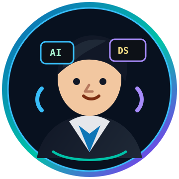

  

<table>
  <tr>
    <td width="28%" align="center" valign="top">
      
      <h2>Mehmood Ul Haq</h2>
      
<strong>Data Science Master's Student</strong>

      
AI/ML Engineer | Frontend Developer

      
Lahore, Pakistan

    </td>
    <td width="72%" valign="top">
      <h1>Hi, I'm Mehmood Ul Haq &#128075;</h1>
      
<em>Building intelligent systems that connect research, data science, and real-world engineering.</em>

      

        
        
        
        
        
        
      

      

        
      

    </td>
  </tr>
</table>

  

---

## &#127919; About Me

- Master's student in **Data Science**
- Researcher at **Data Science Lab (DSL), KICS UET Lahore**
- Working as **GET Engineering Officer at NESPAK**
- Modernizing the **NESPAK HR Portal**
- Interests: **AI, predictive modeling, energy forecasting, web systems, cloud**

---

## &#128161; Currently Working On

| Focus | Work |
| --- | --- |
| NESPAK HR Portal | Full system upgrade and frontend improvement |
| AI & Energy Forecasting | Research projects using ML and predictive modeling |
| Scalable ML Apps | Data-driven applications with usable interfaces |

---

## &#128736; Tech Stack

  

  
  
  
  
  

---

## &#128193; Featured Projects

| Project | Description | Stack |
| --- | --- | --- |
| **NESPAK HR Portal Redesign** | Modernizing HR portal workflows and interface | C#, ASP.NET, SQL Server |
| **Energy Forecasting Using ML** | Short, medium, and long-term energy demand forecasting | Python, ML |
| **Smart Fire System** | Fire detection with YOLOv11, sensors, and control logic | Computer Vision, IoT |
| **SeoulMate** | AI-powered K-drama recommendation and personalized companion system | AI, NLP, Recommender System |
| **WifiX** | Same-network file transfer app with WiFi-focused workflow | React, Python, FastAPI |
| **Datalyzer** | Dataset cleaning, analysis, and visualization toolkit | Python, Analytics |

---

## &#128202; GitHub Snapshot

| Profile | Languages |
| --- | --- |
| Open-source learner and builder focused on AI, data, and frontend projects. | Python, JavaScript, TypeScript, C#, SQL, HTML, CSS |

  
  

---

## &#128279; Connect

  
  
  
  
  

  <strong>Open to collaboration on AI, ML, data science, frontend, and full-stack projects.</strong>

